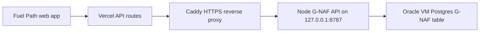

# Oracle G-NAF live architecture

Date: 2026-06-29

## Status

Production G-NAF lookup is live-capable through the Oracle-hosted API path.

Runtime source of truth:

- App: `https://fuel-path.vercel.app`
- G-NAF API mode: `api`
- Hosted address rows: `16,905,824`
- Public exact-address claims: allowed only when `/api/status` lookup readiness is `ready`

## Architecture



## Production configuration

Vercel production requires:

- `FUEL_PATH_GNAF_API_URL`
- `FUEL_PATH_GNAF_API_TOKEN`
- `FUEL_PATH_GNAF_ADDRESS_ROWS`
- `FUEL_PATH_GNAF_EXACT_SMOKE_STATUS`
- `FUEL_PATH_GNAF_BENCHMARK_STATUS`
- `FUEL_PATH_GNAF_BENCHMARK_AT`
- `FUEL_PATH_GNAF_BENCHMARK_CASES`
- `FUEL_PATH_GNAF_BENCHMARK_ADDRESS_TOP_RATE`
- `FUEL_PATH_GNAF_BENCHMARK_POI_TOP_RATE`
- `FUEL_PATH_GNAF_BENCHMARK_ADDRESS_P90_CHARS`
- `FUEL_PATH_GNAF_BENCHMARK_POI_P90_CHARS`

Do not put the G-NAF token in browser-exposed variables.

## Readiness gates

Production is green only when all are true:

- `/api/status` reports `geocoding.lookupReadiness.status = ready`.
- Hosted address index mode is `api` or `postgres`.
- Hosted row count is at least `10,000,000`.
- Exact-address smoke status is `passed`.
- Hosted benchmark status is `passed`.
- Hosted benchmark includes at least `900` cases.
- Address top-rate is `1.0`.
- POI top-rate is at least `0.98`.
- Address p90 chars is at most `42`.
- POI p90 chars is at most `12`.

## Current benchmark evidence

Fresh production benchmark run:

- Evidence file: `tmp/geocode-hosted-national-benchmark-oracle-prod-2026-06-29-900-rerun.json`
- Cases: `900`
- Address cases: `600/600` top match
- POI cases: `300/300` top match
- Address p90 chars: `22`
- POI p90 chars: `6`

Focused regression evidence:

- Wodonga `Shop 45` boulevard/range address resolves as G-NAF top result.
- Coober Pedy `Lot 1620` resolves as G-NAF top result.
- SA/TAS/NT regional POIs resolve without external timeout regressions.

## Operational checks

Use these checks after G-NAF code, infra, env, or benchmark changes:

```bash
npm run check:lookup-readiness -- --api-base https://fuel-path.vercel.app
npm run test:geocode-focused-regression -- --api-base https://fuel-path.vercel.app
npm run check:production-lookup-monitor -- --api-base https://fuel-path.vercel.app
```

Use the full 900-case benchmark before changing public exact-address claims:

```bash
npm run test:geocode-hosted-national -- --mode http --api-base https://fuel-path.vercel.app --address-count 600 --poi-count 300 --profile rural-unit --case-context --delay-ms 250
```

## Failure policy

If a fresh hosted benchmark fails, production benchmark env evidence must be updated to `failed` and redeployed before reporting public readiness.

If `/api/status` is green but release evidence is blocked, rerun the release summary with explicit lookup readiness, hosted preview, and hosted national benchmark evidence.
